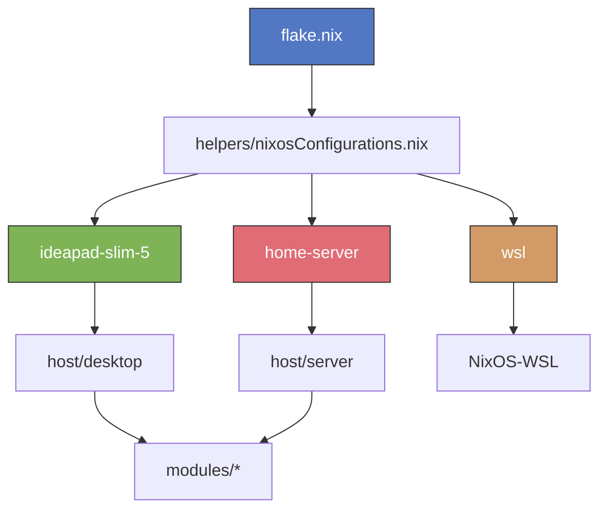

<p align="center">
  
</p>

<h1 align="center">❄️ AsakiYuki's NixOS</h1>

<p align="center">
  <em>Modular, multi-device NixOS configuration powered by Flakes</em>
</p>

<p align="center">
  
  
</p>

---

## 🖥️ Devices

| Target | Description |
|:---|:---|
| `ideapad-slim-5` | Lenovo IdeaPad Slim 5 — Full desktop (KDE Plasma, Hyprland, Niri) |
| `home-server` | Headless server (Forgejo, Nginx, Nextcloud, SearX, AdGuard Home) |
| `wsl` | WSL — Lightweight CLI environment |

---

## 📂 Structure

```
.
├── flake.nix              # Entrypoint
├── devices/               # Per-device configs (hardware, boot, services)
├── host/                  # Shared presets (desktop / server)
├── users/                 # Per-user declarations (asakiyuki, hieze, junko)
├── modules/               # Reusable NixOS & Home Manager modules
├── options/               # Custom option declarations (device.dm.*, device.de.*, etc.)
├── helpers/               # Lib extensions (mkUsers, mkProgramOption, etc.)
├── overlays/              # Nixpkgs overlays
├── flakes/                # Internal sub-flakes (cursors, custom packages)
├── assets/                # Static assets, public keys, encrypted secrets
├── secrets.nix            # Agenix secret declarations
├── build.sh               # Quick rebuild
├── install.sh             # Fresh install
└── agenix.sh              # Secret management helper
```

---

## 🚀 Usage

### Build & Switch

```bash
# Clone to /etc/nixos, then:
./build.sh <target>

# Examples:
./build.sh ideapad-slim-5
./build.sh home-server
./build.sh wsl
```

### Fresh Install

```bash
./install.sh <target>
```

### Flake Commands

```bash
nix build .#nixosConfigurations.<target>.config.system.build.toplevel
nix flake check
nix flake update
nix flake show
```

### Secrets (Agenix)

```bash
# Edit a secret
./agenix.sh -e assets/secrets/services/cloudflare.secret.age

# Re-key all secrets
./agenix.sh -r
```

> `secret.key` must be present locally (git-ignored).

### Sub-flakes

This repo ships two standalone sub-flakes you can use independently in your own config:

#### 🖱️ Custom Cursors (`flakes/cursors`)

A Home Manager module providing anime-themed cursor packs (Honkai, Wuthering Waves, etc.).

```nix
# flake.nix
{
  inputs.cursors.url = "github:asakiyuki/nixos?dir=flakes/cursors";

  # In your Home Manager config:
  # imports = [ inputs.cursors.homeModules.default ];
}
```

```nix
# home.nix
{
  theme.cursors = "elysia"; # or: castorice, aemeath, denia, cartethyia, yangyang, hiyuki, lucilla
}
```

#### 📦 Custom Packages Overlay (`flakes/overlays`)

Adds `cage-xtmapper`, `cider-2`, `bun-baseline`, `geode-cli`, `lsfg-vk` to nixpkgs.

```nix
# flake.nix
{
  inputs.asa-overlay.url = "github:asakiyuki/nixos?dir=flakes/overlays";
}
```

```nix
# configuration.nix
{
  nixpkgs.overlays = [ inputs.asa-overlay.overlays.default ];

  environment.systemPackages = with pkgs; [
    cider-2
    geode-cli
    # ...
  ];
}
```

---

## 🧱 Architecture



`helpers/nixosConfigurations.nix` takes device definitions from `flake.nix` and wires up extended `lib`, unstable channel, Home Manager, agenix, Chaotic-Nyx, and all shared modules automatically.

---

## 📄 License

[GPL-3.0](./LICENSE)
